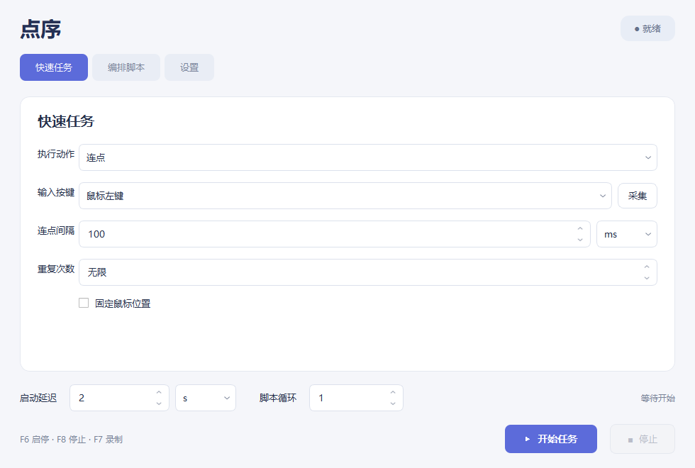
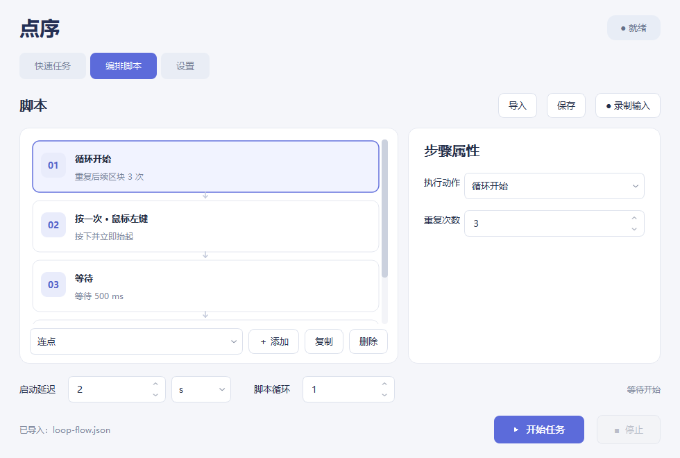

# 点序 · LianDianQi

轻量的 Windows 连点器，用 **C++17 / Qt 6 Widgets** 编写。中文界面，可视化步骤流程，点窗口 × 直接退出。



## 功能

- 鼠标左/右/中/侧键，键盘任意单键；支持采集真实输入，区分左右修饰键和小键盘。
- 连点、长按、按下、抬起、按一次；支持固定坐标、多屏及负坐标。
- 拖动步骤卡片编排流程，支持等待、移动鼠标、嵌套循环、整条脚本循环和 JSON 导入保存。
- 录制键盘/鼠标按下抬起事件、点击位置和间隔；不录制移动轨迹和滚轮。
- 全局快捷键：**F6 启停 / F8 停止 / F7 录制**，可修改并检测占用冲突。
- FloatingBall 配置式接入：启动、正常停止、显示窗口及进程状态。
- 单实例、事件驱动；空闲无执行轮询，不驻留托盘，无后台子进程、服务和开机项。



## 下载与使用

从 [Releases](https://github.com/wjy1603283179/LianDianQi/releases) 下载 Windows x64 ZIP，完整解压后双击 `LianDianQi.exe`。
无需安装 Qt 或 Python。程序首次打开不会自动发送输入。

选择按键和动作，设置参数，F6 开始；默认 2 秒后执行，留出切换窗口的时间。F8 随时停止。
点 × 会停止任务、释放程序按住的键、注销快捷键和采集钩子并退出进程。

完整说明：[USAGE.md](docs/USAGE.md)。管理员窗口需要同级权限；部分游戏和系统安全界面可能拒绝模拟输入。
正常关闭的释放保证不包含强制结束进程、断电或系统崩溃。

## 接入 FloatingBall

在解压后的便携包目录执行：

```powershell
powershell.exe -NoProfile -ExecutionPolicy Bypass -File .\scripts\register-floatingball.ps1
```

默认路径为 `D:\Small_App\MangaDownloadTools\FloatingBall`，可用 `-FloatingBall` 修改。
只更新 tools.json 中的 liandianqi 项，原文件自动备份。FloatingBall “启 / 停”管理程序进程，任务启停使用 F6。
不修改 FloatingBall 源代码；移动便携包后重新注册即可。

## 构建与测试

Windows 10/11 x64，Qt 6.5+，Visual Studio 2019/2022 C++ 工具链，CMake 3.20+ 和 Ninja。
本地发布包使用 Qt 6.5.3 / MSVC 2019 动态链接；CI 使用相同 Qt 版本。

```powershell
python -m pip install aqtinstall
python -m aqt install-qt windows desktop 6.5.3 win64_msvc2019_64 -O .tools\Qt --archives qtbase
powershell.exe -NoProfile -ExecutionPolicy Bypass -File scripts\build.ps1
```

也可给 build.ps1 传入 `-QtRoot`，使用已有 Qt 开发套件。构建会执行 QtTest。
测试报告写入 `build/test-results.txt`；集成测试见 `tests/native_smoke.py`。

```powershell
python scripts\prepare-licenses.py
powershell.exe -NoProfile -ExecutionPolicy Bypass -File scripts\package.ps1
python tests\native_smoke.py --exe dist\DianXu-1.0.1-windows-x64\LianDianQi.exe
```

便携包包含运行依赖、示例、接入脚本、使用说明和第三方许可。ZIP 附有 SHA-256 校验文件。
维护者重生成图标时需要 Pillow，已生成的图标包含在仓库中，普通构建不需要 Pillow。

## 实现与许可

执行器使用单次 `QTimer` 调度，停止会取消待执行步骤并释放程序持有的按键。
输入使用 Windows `SendInput`，采集使用按需安装的低级钩子，快捷键使用 `RegisterHotKey`。
单实例由当前用户的命名互斥体保护，控制使用仅当前用户可访问的本地命名管道，没有 HTTP 服务。

项目代码使用 [MIT](LICENSE)。Qt 使用 LGPL-3.0，保持动态链接，发布包包含许可、第三方声明和准确版本的源码下载地址。
可替换兼容的 Qt 动态库；允许为调试 Qt 修改而进行逆向工程。详见 [Qt 许可文件](docs/qt-licenses/SOURCE-OFFER.txt)。
